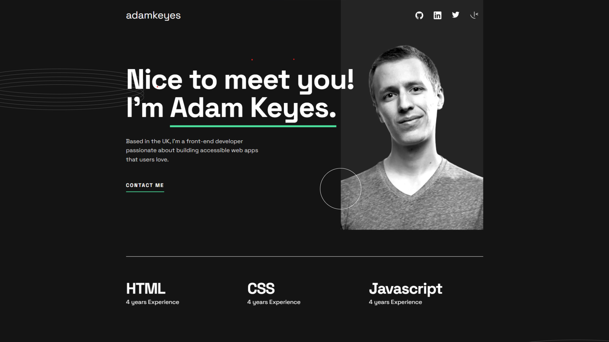
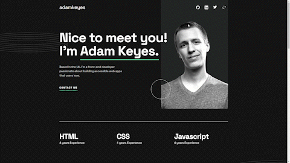

# Frontend Mentor: Solución de Single-page developer portfolio

Esta es mi solución a [Single-page developer portfolio en Frontend Mentor](https://www.frontendmentor.io/challenges/singlepage-developer-portfolio-bBVj2ZPi-x). Los desafíos de Frontend Mentor lo ayudan a mejorar sus habilidades de codificación mediante la creación de proyectos realistas.

## Tabla de contenido

- [Frontend Mentor: Solución de Single-page developer portfolio](#frontend-mentor-solución-de-single-page-developer-portfolio)
  - [Tabla de contenido](#tabla-de-contenido)
  - [Descripción general](#descripción-general)
    - [El reto](#el-reto)
    - [Captura de pantalla](#captura-de-pantalla)
    - [Enlaces](#enlaces)
  - [Mi proceso](#mi-proceso)
    - [Herramientas](#herramientas)
    - [Que aprendí](#que-aprendí)
      - [Archivos SVG como componentes React](#archivos-svg-como-componentes-react)
        - [_demostración del código_](#demostración-del-código)
      - [Renderizar elementos en bucles anidados](#renderizar-elementos-en-bucles-anidados)
        - [_demostración del código_](#demostración-del-código-1)
    - [Desarrollo continuo](#desarrollo-continuo)
      - [En qué mejorar](#en-qué-mejorar)
      - [Metas futuras](#metas-futuras)
    - [Recursos útiles](#recursos-útiles)
  - [Autor](#autor)

## Descripción general

### El reto

Los usuarios deben ser capaces de:

- Recibir un mensaje de error cuando se envía el `formulario` si:
   - Cualquier campo está vacío ✅
   - La dirección de correo electrónico no tiene el formato correcto ✅
- Ver el diseño óptimo para la interfaz según el tamaño de pantalla de su dispositivo ✅
- Vea los estados de desplazamiento y enfoque para todos los elementos interactivos en la página ✅
- **Bonificación**: Conecta el formulario para que envíe y almacene la consulta del usuario (puedes usar una hoja de cálculo o Airtable para guardar las consultas) ❌
- **Bonificación**: agregue sus propios detalles (imagen, habilidades, proyectos) para reemplazar los del diseño ✅

### Captura de pantalla




### Enlaces

- Github Repository: [Reposiroty](https://github.com/d4nnym/single-page-developer-portfolio)
- Github Page: [Single Page Developer Portfolio](https://d4nnym.github.io/single-page-developer-portfolio)

## Mi proceso

### Herramientas

- [React](https://es.react.dev/) 
- [SASS](https://sass-lang.com/) 
- [Bulma](https://bulma.io/) 
- [AOS (Library)](https://michalsnik.github.io/aos/) 

### Que aprendí

#### Archivos SVG como componentes React

React nos ofrece la posibilidad de utilizar archivos SVG como componentes. Esto nos permite estilizarlos y utilizarlos como cualquier otro componente, cargando toda sus propiedades para explotarlas al máximo. 

```js
import {ReactComponent as SvgName} from '../url/file.svg';

export default function Component(){
  return(
    <SvgName />
  )
}

```

Esto da solución al tener que utilizar largos y extensos códigos XML para mostrar un archivo SVG.

```html
<svg height="25px" width="25px" xmlns="http://www.w3.org/2000/svg" class="svg-component"><path fill="#FFF" fill-rule="evenodd" d="M12.304 0C5.506 0 0 5.506 0 12.304c0 5.444 3.522 10.042 8.413 11.672.615.108.845-.261.845-.584 0-.292-.015-1.261-.015-2.291-3.091.569-3.891-.754-4.137-1.446-.138-.354-.738-1.446-1.261-1.738-.43-.23-1.046-.8-.016-.815.97-.015 1.661.892 1.892 1.261 1.107 1.86 2.876 1.338 3.584 1.015.107-.8.43-1.338.784-1.646-2.738-.307-5.598-1.368-5.598-6.074 0-1.338.477-2.446 1.26-3.307-.122-.308-.553-1.569.124-3.26 0 0 1.03-.323 3.383 1.26.985-.276 2.03-.415 3.076-.415 1.046 0 2.092.139 3.076.416 2.353-1.6 3.384-1.261 3.384-1.261.676 1.691.246 2.952.123 3.26.784.861 1.26 1.953 1.26 3.307 0 4.721-2.875 5.767-5.613 6.074.446.385.83 1.123.83 2.277 0 1.645-.015 2.968-.015 3.383 0 .323.231.708.846.584a12.324 12.324 0 0 0 8.382-11.672C24.607 5.506 19.101 0 12.304 0Z"></path></svg>
```

**¿Por qué utilizar archivos SVG como componentes de React?**

En esta parte del reto, queremos darle vida e interactividad a las diferentes redes sociales en la barra de navegación. Utilizar la etiqueta `````` no nos permite explorar las propiedades de los archivos SVG. Una forma es utilizar ```<svg></svg>```, sin embargo, el código se vuelve extenso y difícil de leer.



##### _demostración del código_

**Json para controlar los datos.** Se cargan los archivos y les asiganamos un alias. 

```jsx
// ver en: src/data/mediadata.js
import { ReactComponent as SvgGithub } from '../assets/images/icon-github.svg';
import {ReactComponent as SvgLinkedin} from '../assets/images/icon-linkedin.svg';
import {ReactComponent as SvgTwitter }from '../assets/images/icon-twitter.svg';
```

Luego exporto cada archivo svg con información extra: nombre, _componente_, título y su dirección(este ultimo caso es para los anchors ```<a href=""/>```). SvgComponent es el atributo que se encarga de almacenar el contenido del archivo SVG. 
  
```js
// ver en: src/data/mediadata.js
export const websites = [
  {
    name:"github",
    SvgComponent:SvgGithub,
    title:"to Adam's Github",
    href:"#"
  }, 
  {
    name:"linkedin",
    SvgComponent:SvgLinkedin,
    title:"to Adam's Linkedin",
    href:"#"
  },
  {
    name:"twitter",
    SvgComponent:SvgTwitter,
    title:"to Adam's Twitter",
    href:"#"
  },
  {
    name:"frontendMentor",
    SvgComponent:SvgFrontendMentor,
    title:"to Adam's Frontend Mentor",
    href:"#"
  }

]
 ```

 Por último utilizo los componentes SVG en el lugarrequerido. 

```js
// ver en: src/common/Brandbar.js
import { websites } from "../data/mediadata"; // 

function Component(){
  const websiteList = websites.map((website) => {
    return (
      <li key={website.name} className="website">
        <a href="/#">
          <website.SvgComponent className="svg-component"/>
        </a>
      </li>);
  })

  return(<ul className="is-flex is-align-items-center">{websiteList}</ul>);
}
```

####  Renderizar elementos en bucles anidados   

**Fragments** fue mi solución. React utiliza la sintaxis ```<></>``` para agrupar multiples elementos. Sin embargo, al momento de renderizar un lista de elementos, es necesario utilizar la prop **key={id}**. La solución es utilizar  el componente de react ```<Fragment></Fragment>```. 

##### _demostración del código_

```jsx
// ver en: src/components/main/Projects.js
import {Fragment} from 'react';

export default ...
  const projects = projectImages.map((project) => {
      const tools = project.tools.map((tool, j) => {
        return (
          <span key={tool + j} className="pr-2 is-uppercase">
            {tool}
          </span>
        );
      });

      return(
        <Fragment key={project.id}>
          {tools}
        </Fragment > 
      )})

```

### Desarrollo continuo

Terminar un proyecto es muy satisfactorio y emocionante. Sin embargo, siempre hay algo que mejorar. 

#### En qué mejorar
- Clean code y la organización de los archivos. 
- Optimización de código **SASS** 
- Mejorar la independencia de los componentes

#### Metas futuras 

- Ampliar conocimientos en HTML y SASS
- Mejorar animación 
- Funcionalidad de cambio de temas 

### Recursos útiles

**Recursos que siempre mantengo a mano**

- [HTML y CSS](https://marksheet.io/) - Cuando requiero de algo, rápidamente puedo encontrarlo. 
- [FlexBox Guide](https://css-tricks.com/snippets/css/a-guide-to-flexbox/) - Esto nunca puede faltar XD
- [Bootstrap](https://getbootstrap.com/) - Si bien no lo utilizo en mis proyectos. Lo recomiendo para aprender a cómo crear tus propios componente. Por ejemplo un modal o un barra de navegación. Bootstrap tiene una documentación muy completa y fácil de entender. 

## Autor

- Mentor de frontend — [@d4nnym](https://www.frontendmentor.io/profile/d4nnym)
- Twitter — [@dannymatute_](https://twitter.com/dannymatute_)

<style>
  img{
   border-radius: 8px;
  }
</style>